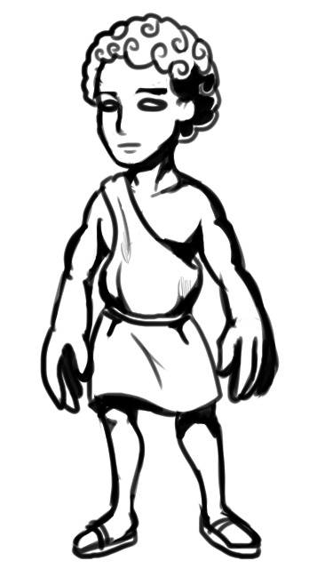
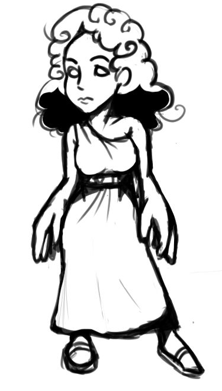
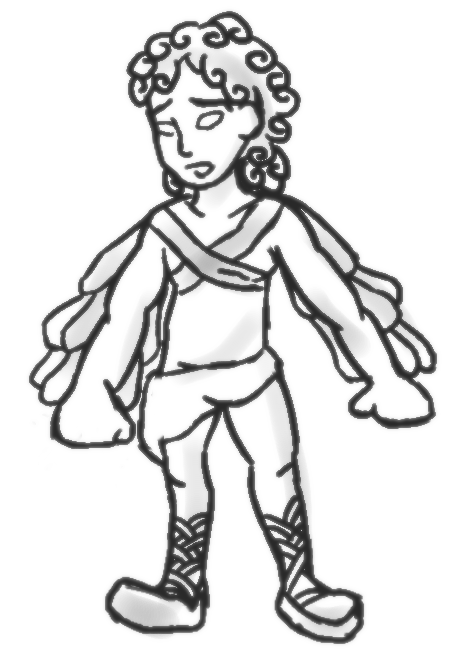
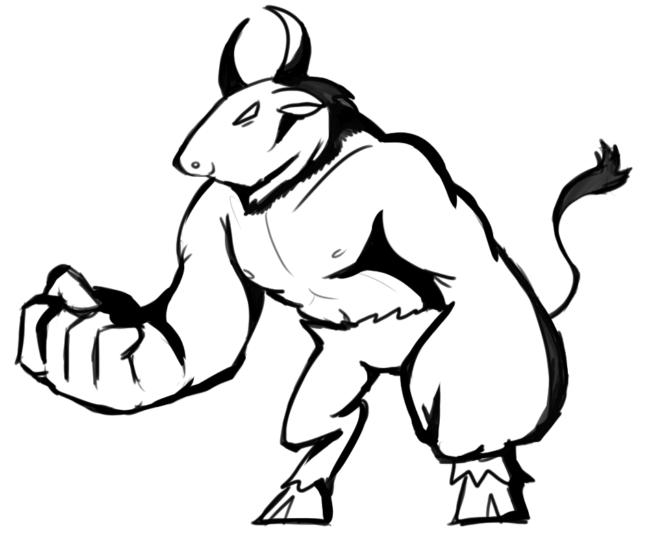
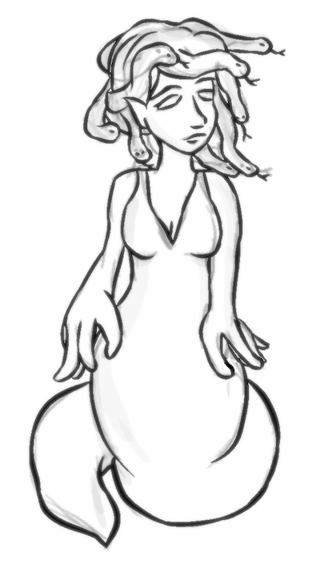

# GDD

# 1. Introducción

Este es el documento de diseño de DarkMaze, un videojuego multijugador para PC. Aquí quedarán plasmados todos los elementos incluidos en DarkMaze.

  ## 1.1. Concepto del juego
  
  DarkMaze es un juego multijugador basado en el Laberinto de Creta de la mitología griega. Los dos tipos de personajes son Buscadores y Perseguidos. Durante las partidas cada jugador manejará a uno de los dos tipos de personaje. El propósito del Buscador es atrapar a los Perseguidores, mientras que cada Perseguidor debe intentar aguantar con vida el máximo tiempo posible. Los roles se intercambiarán en una segunda ronda.
  
  ##  1.2. Características principales
  
  <b>Partidas dinámicas:</b> Los jugadores intercambian roles, las partidas son fluidas.
  
  <b>Toque estratégico:</b> Las dintintas habilidades y mecánicas aportan un toque de estrategia que hace a cada partida diferente.
  
  <b>Posibilidad de más contenido:</b> Sobre el juego se pueden añadir fácilmente más personajes, nuevas habilidades u objetos, etc...
 
  ##  1.3. Género
  
  Se trata de un juego Arcade de sigilo y multijugador. El que juegue como Minotauro será el Buscador y el que juegue como Teseo será el Perseguido.
  
  ##  1.4. Propósito y público objetivo
  
  El propósito del juego es intentar aportar una experiencia multijugar divertida. Cada partida del juego es diferente para que este pueda disfrutarse una y otra vez.
  
  El juego va dirigido a cualquier jugador que quiera disfrutar de una partida rápida con amigos en un juego de reglas sencillas pero que puede llegar a resultar bastante estratégico.
  
  ##  1.5. Jugabilidad
  
  <b>Escenarios:</b> Todos los posibles escenarios del juego son distintos laberintos en los que pueden transcurrir las partidas. Cada laberinto tendrá un diseño distinto para conseguir que cada partida sea distinta y transcurra de forma diferente.
  
  <b>Habilidades:</b> Cada jugador tiene una habilidad distinta. El Minotauro tiene la capacidad de utilizar dos antorchas en cualquier lugar del escenario para iluminar parte del laberinto y encontrar a los Perseguidores con mayor facilidad, mientras que Teseo tiene la habilidad de colocar una roca que le permite bloquear el camino y aumentar su velocidad para huir con mayor facilidad.
  
  <b>Habilidades Especiales:</b> Estas habilidades se cargan y son grandes habilidades que hacen grandes cambios en el modo de juego, además, permite mayor diferenciación entre personajes, pues cada personaje tiene una distinta. Un aviso especial aparecerá en las pantallas de todos los jugadores cuando se usen.
  
  <b>Pulsos:</b> Los pulsos serán pequeñas luces rojas que aparecerán en la posición de los Perseguidos si estos deciden correr para aumentar su velocidad, de esta forma, los Buscadores podrán ver durante un instante en qué posición se encuentran los Perseguidos en ese momento.
  
  
  ##  1.6. Estilo visual
  
  
  
  El juego está ambientado en el Laberinto de Creta, de la mitología griega. Por tanto, el juego tiene una estética griega, con personajes como el Minotauro y otros personajes típicos de mitología.
  
  ##  1.7. Alcance

El juego trata de ser una experiencia divertida multijugador en la que se puedan seguir añadiendo estratégicos para aumentar la profundidad de este.

# 2. Mecánicas de juego

En este apartado detallaremos todas las mecánicas de DarkMaze, incluyendo los elementos básicos de la jugabilidad y las acciones  que puede realizar cada jugador durante una partida.

  ##  2.1. Jugabilidad
  
  En DarkMaze se juega como Perseguido o como Buscador, cada uno funciona de la siguiente manera:
  
  
  
  <b>Buscador:</b> El Buscador ha de buscar al Perseguido a traves de un laberinto muy oscuro, el Buscador tiene una fuente de luz que le permite ver un poco a su alrededor. Su visibilidad reducida se ve recompensada con una mayor velocidad.
  La visibilidad reducida implica que no ve la posición del Perseguido a menos que este corra, pero sí que es capaz de ver en la penumbra las paredes del laberinto completo, es decir, su estructura, y podrá basarse en esta para crear una estrategia.
  El Buscador posee un botón de ataque, con él, podrá atrapar al Perseguido y destrozar las rocas del camino que coloque el Perseguido al huir.
  
   
    
   
    
  Entre sus habilidades especiales, el Buscador puede poner dos faros en el mapa que iluminarán una zona permanentemente. Los faros podrán ser recogidos por el Buscador si este se desplaza hasta su posición para poder ser puestos en otras zonas del mapa.
  
   
    
  Finalmente, el Buscador posee una barra que al cargarse, podrá usar desatar una poderosa habilidad especial, ayudando así a encontrar al Perseguido con más facilidad.
  
   
  
  <b>Perseguido:</b> Es el jugador que debe esconderse. Su fuente de luz es mucho más amplia que la del Buscador, por lo que puede verlo desde mucha más distancia, también puede ver la estructura del laberinto en la penumbra. En cambio, su velocidad es menor y por defecto caminará.
  Ícaro puede correr, pero esto generará un pulso que puede ser visto por el Buscador, alertando así la posición del Perseguido.
  
   
  
  Finalmente, puede poner una roca durante la partida a sus espaldas, cortando así el paso al minotauro. Solo puede colocar una roca por partida.
  
   
  
  ##  2.2. Flujo de juego
  
  En este apartado se detalla el transcurso de una partida de DarkMaze y se describen todos los pasos que puede seguir cada jugador hasta finalizar la partida.
  
  Al iniciar el juego se presenta el Menú Principal, donde el jugador tiene disponible la opción Jugar para empezar una partida.
  Se debe especificar el número de jugadores que quiere que haya en la partida, siempre en números pares.
  A continuación se presenta una tabla con el número total de jugadores y cuántos Bucadores habrá en la partida:
  
| Nº Jugadores | Buscador | Perseguidos |
|--------------|----------|-------------|
| 2            | 1        | 1           |
| 4            | 2        | 2           |
| 6            | 3        | 3           |
  
 También dependiendo del número de jugadores, se regulará el número de antorchas y rocas.
 
 Antes de comenzar, se elige un personaje tipo "Buscador" y un personaje tipo "Perseguido", también se elige en qué escenario
  transcurrirá la partida. 
  
  Una vez comienza la partida, el personaje Perseguido y el Buscador aparecerán en esquinas opuestas del escenario y comenzará un contador que servirá para saber cuánto tiempo ha sobrevivido el Perseguido.
  El Buscador tiene su propio rango de visión, pero tendrá disponibles desde el comienzo de la partida dos antorchas que puede colocar en cualquier parte del escenario para detectar al Perseguido si pasa por esas zonas, y su objetivo será buscar al Perseguido por todo el escenario para atraparlo.
  En caso de que el Buscador encuentre al Perseguido, éste último podrá colocar una roca que que bloquee el camino o correr para intentar huir.
  
  Una vez el Buscador haya atrapado al Perseguido, parará el contador y se guardará el tiempo que haya transcurrido. Después, se intercambiarán los roles y el jugador que haya manejado a un Buscador en la primera ronda tendrá que manejar a un Perseguido y viceversa.
  
  Cuando haya terminado la segunda ronda, se compararán los dos tiempos y ganará la partida el jugador que haya aguantado más tiempo con vida manejando a un Perseguidor.
  
  Todo lo explicado anteriormente se aplica a equipos si hay más de 2 jugadores.
  
  Se les propondrá a los jugadores iniciar una partida nueva en un mapa distinto, en cuyo caso se repite el flujo de juego o abandonar.

  ##  2.3. Personajes
  
  En este apartado describiremos los personajes de DarkMaze y sus habilidades.
  
  ### 2.3.1 Perseguidos
   
   __Teseo:__
   
  
  
  Héroe ofrecido voluntario para luchar contra el minotauro, pero que se ha perdido un poco.
  
    Stats
    * Velocidad: Media
    * Rocas: 1
    * Visión: Alta
  
  _Camuflaje_: Teseo puede hacerse invisible durante un periodo de tiempo, pero no puede moverse sin quitarse su invisibilidad.
  
  __Ariadna:__
  
  
  
  Princesa Cretense, ha ido al laberinto en busca de Teseo.
  
     Stats
     * Velocidad: Poca
     * Rocas: 3
     * Visión: Normal
  
  _Hilo brillante_: Revela la posición del Buscador durante un periodo de tiempo.
  
  <b>Ícaro:</b> 
  
   
  
  Joven hijo de Dédalo que intentó huir del laberinto, pero que ha vuelto a caer en él.
  
     Stats
     * Velocidad: Alta
     * Rocas: 2
     * Visión: Poca
  
  _Alas temporales_: Ícaro puede saltar una pared con esta habilidad, siempre que haya suelo al otro lado.
  
  ### 2.3.2 Buscadores
  
  <b>Minotauro:</b> 
  
  
  
  Guardián del laberinto, es mitad hombre, mitad toro.
  
     Stats
     * Velocidad: Alta
     * Faro: 2
     * Visión: Poca
  
  _Instinto_: Permite aumentar bastante su campo de visión durante un breve periodo de tiempo. 
  
  <b>Cíclope:</b>
  
  Miembro de la familia de los gigantes que posee un solo ojo. 
    
     Stats
     * Velocidad: Poca
     * Faros: 3
     * Visión: Normal
  
  _Vigilante_: Permite a una de sus antorchas cobrar vida y desplazarse en linea recta por el escenario. Si la antorcha ve a un Perseguidor, será atacado por la misma. 
   
  <b>Medusa:</b>
  
  
    
  Monstruo capaz de convertir, con su mirada, en piedra.
    
     Stats
     * Velocidad: Normal
     * Faros: 1
     * Visión: Mucha
  
  _Mirada Pétrea_: Si la usa cuando alguien pasa en su campo de visión (o el de su faro) el Perseguidor se converitá en piedra durante unos segundos.
  
  
  ##  2.4. Controles
  
  Los jugadores tendrán la posibilidad de moverse por el escenario y de utilizar habilidades. Además, el personaje de Ícaro tendrá la posibilidad de correr para aumentar su velocidad.
  
  - Movimiento: Teclas W,A,S,D
  - Usar habilida activa (ícaro colocar bloque y minotauro atacar): barra espaciadora
  - Colocar linternas (en el caso del minotauro): tecla R
  - Correr: Tecla Mayús
  
  ## 2.5. Escenas
  
  En este apartado quedan descritas todas las escenas que habrá en el juego:
  
  <b>Menú principal:</b> Es la primera escena que aparece al iniciar el juego. En esta opción el jugador tiene la opción de empezar una partida, entrar en las opciones del juego o salir del juego.
  
  <b>Opciones:</b>
  
  <b>Selección de mapa:</b> En esta escena el jugador puede elegir en qué escenario quiere jugar su siguiente partida. Habrá dos flechas para ir pasando de un mapa a otro hasta que encuentre el que quiera jugar.
  
  <b>Selección de personaje:</b> Los jugadores tendrán la posibilidad de elegir con qué personaje quieren jugar la partida. Los que tengan que huir podrán elegir entre Ícaro, Teseo y Ariadna, mientras que los perseguidores podrán elegir entre el Minotauro, Cíclope y Medusa.
  
  <b>Distribución de equipos:</b> Los jugadores serán distribuídos en dos equipos (perseguidos y perseguidores) en base a su rango, que es calculado con el número de victorias y derrotas de las partidas que han jugado. Los equipos estarán equilibrados entre ellos para lograr una experiencia de juego más justa y entretenida.
  
  <b>Juego:</b> Es la escena en la que transcurrirán las partidas, durará hasta que el perseguidor (o alguno de los perseguidores en caso de que haya más) alcance al jugador (o jugadores) que tiene que huir. Los tiempos de cada ronda se guardarán para hacer la tabla de resultados de la escena siguiente.
  
  <b>Tabla de resultados:</b> Aparecerá cuando termina la escena de juego, y es donde se mostrarán los resultados de cada jugador para determinar quién ha ganado.
  
# 3. Interfaz
  
  El juego dispondrá de un chat entre todos los jugadores desde el menú de selección del personaje hasta el inicio de la partida, una     vez dentro de la partida el chat será entre miembros del mismo equipo para poder planificar sus estrategias sin ser descubiertos por     sus rivales.
  
  ##  3.1. Diagrama de flujo
  
  
  
  ##  3.2. Menú Principal
  
  
  
  ## 3.3. Selección de personaje
  
  ## 3.4. Distribución de equipos
  
  Los jugadores serán distribuídos en dos equipos (perseguidos y perseguidores) en base a su rango, que es calculado con el número de     victorias y derrotas de las partidas que han jugado. Los equipos estarán equilibrados entre ellos para lograr una experiencia de juego   más justa y entretenida.
  
  ##  3.5. Selección de nivel
  
  
  
  ##  3.6. Juego (Minotauro)
  
  
  
  ##  3.7. Juego (Ícaro)
  
  
  
  ##  3.8. Resultados
  
  

# 4. Arte

El principal objetivo del arte de DarkMaze es provocar sensación de tensión en los jugadores, tanto en el apartado visual como auditivo. Esto lo conseguiremos haciendo que los jugadores tengan poco rango de visión y añadiendo música que genere tensión durante el transcurso de las partidas.

  ## 4.1. Arte 2D
  
  Los personajes jugables tendrán las siguientes animaciones: 
  
  <b>Perseguidos:</b> Quieto, andar, correr, usar habilidad, recibir daño.
  <b>Buscadores:</b> Quieto, andar, atacar, usar habilidad.
  
  Además, estos son algunos de los elementos (que se irán ampliando) que se diseñarán para el juego:
  
  <b>Menú</b>
  - Logotipo
  - Botón Jugar
  - Botón Opciones
  - Botón Salir
  - Flecha Izquierda/Derecha: Usadas para la selección de mapa antes de iniciar la partida.
  
  <b>Partida</b>
  - Escenario: Suelo.
  - Escenario: Pared.
  - Escenario: Esquina.
  - Antorcha.
  - Roca.
  - Pulso.
  
  ## 4.2. Audio
  
  Estos serán los elementos de audio que se utilicen para el juego:
  
  <b>Música</b>
  - Menú principal: Será música de aventura y tensión, aunque más relajada que la música que habrá durante las partidas.
  - Partida: Música que genere tensión en el jugador, especialmente en el jugador que maneje a Ícaro.
  - Victoria: Será la música que escuche el jugador que gane la partida, ésta será más alegre que la escuchada durante la partida.
  - Derrota: Música triste que escuchará el jugador que pierda.
  
  <b>Efectos de sonido</b>
  - Ataque: Golpe producido al atacar.
  - Antorcha: Sonido provocado al colocar una antorcha en el escenario.
  - Roca: Sonido al colocar una roca en el suelo del escenario.
  - Pulso: Sonido generado al correr que solo puede escuchar el Buscador.
  - Correr: Sonido de los pasosal correr que solo puede escuchar el Perseguido.
  

# 5. Equipo de desarrollo

Carlos Padina González
cv.padina@alumnos.urjc.es
GitHub: twisterloop

Laura Suonpera Lozano
l.suonpera@alumnos.urjc.es
GitHub: lauraluna96

Guillermo Mena Molina
g.menam@alumnos.urjc.es
GitHub: guillermomena

Repositorio: https://github.com/KeyItemTeam/DarkMaze
  
  
 

[¡Gracias!](https://i.imgur.com/62oaFrk.png)
